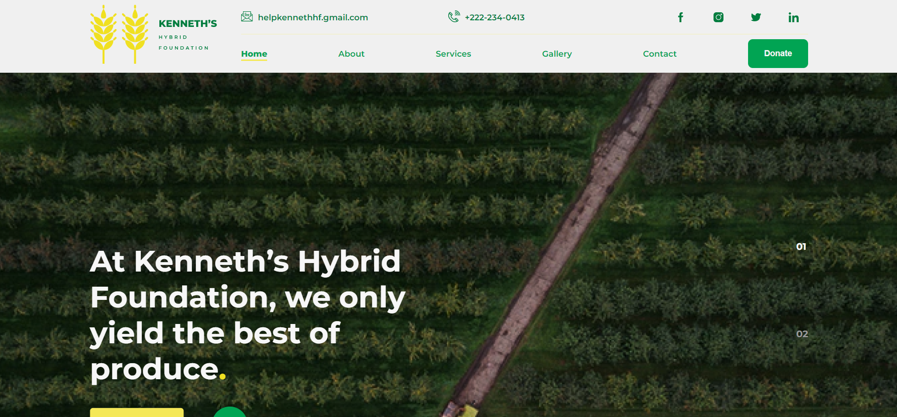

## Kenneth Foundation Showcase website
✨🎉A Nice landing page built with Next Js, Smooth transition between pages using Framer Motion and React-slideshow library for smooth changes of images, and also with a Preloader animated with gsap

### ✨ [Live Demo](https://farm-showcase.vercel.app/)

## Getting Started 

In the project directory, you can run:

### `yarn dev`

Runs the app in the development mode.\
Open [`http://localhost:3000`](http://localhost:3000) to view it in the browser.

